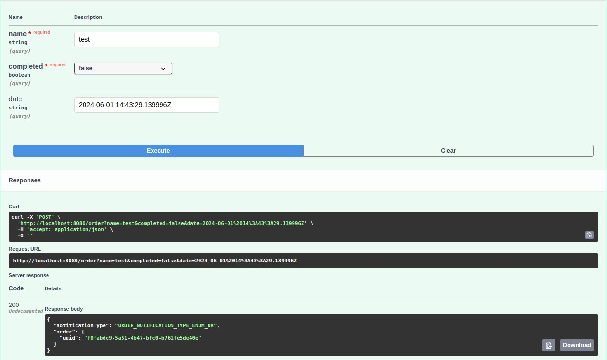
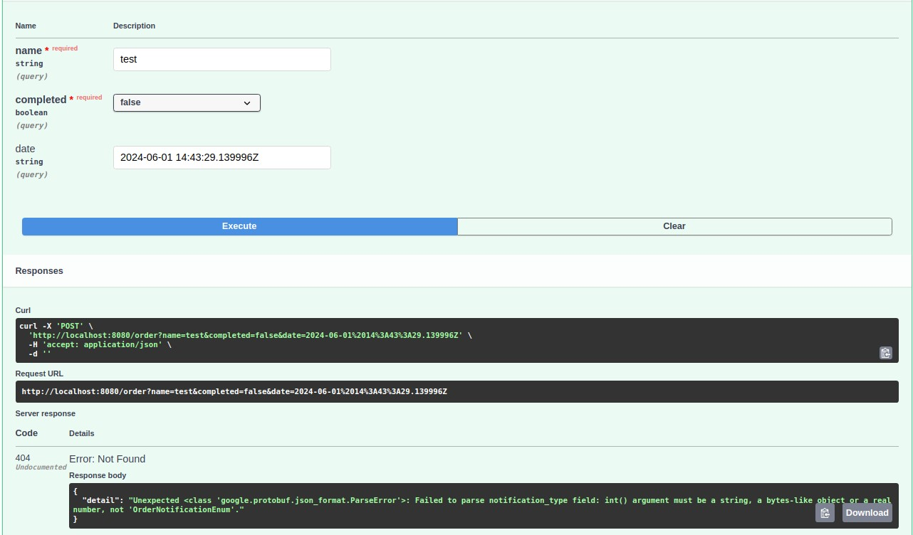

# Основы работы с gRPC на Python: создание сервиса с использованием FastAPI. Часть II.

Продолжение увлекательного путешествия в мир gRPC! После того, как мы освоили основы этого современного фреймворка для построения высокопроизводительных и масштабируемых API в первой части нашей серии ```Введение в gRPC: Основы, применение, плюсы и минусы. Часть I```, настало время приступить к его практическому применению.

Глубже погружаясь в мир разработки клиент-серверных приложений, мы научимся создавать gRPC сервисы с использованием Python, FastAPI и Piccolo ORM. Этот увлекательный этап нашего пути предлагает нам возможность превратить наши теоретические знания в практические.

Готовы ли вы приступить к погружению в удивительный мир gRPC и его практического применения? Давайте начнем это увлекательное путешествие во второй части нашей серии статей о gRPC.

## Определение сервиса

Первый шаг в создании gRPC сервиса — это определение интерфейса с помощью Protocol Buffers (protobuf). Пример определения сервиса для управления заказами может выглядеть так:

```proto
syntax = "proto3";

package order;

service OrderService {
  rpc CreateOrder (CreateOrderRequest) returns (CreateOrderResponse);
}

message CreateOrderRequest {
  string uuid = 1;
  string name = 2;
  bool completed = 3;
  string date = 4;
}

message CreateOrderResponse {
  OrderNotificationTypeEnum notificationType = 1;
  Order order = 2;
}

message Order {
  string uuid = 1;
  string name = 2;
  bool completed = 3;
  string date = 4;
}

enum OrderNotificationTypeEnum {
  ORDER_NOTIFICATION_TYPE_ENUM_UNSPECIFIED = 0;
  ORDER_NOTIFICATION_TYPE_ENUM_OK = 1;
}
```

Здесь мы определяем сервис `OrderService` с методом `CreateOrder`, который принимает `CreateOrderRequest` и возвращает `CreateOrderResponse`. 
Также следует обратить внимание на ```enum OrderNotificationTypeEnum``` — это перечисление, содержащее типы уведомлений о событиях, связанных с созданием заказа. В нашем случае `OrderNotificationTypeEnum` используется для указания типа уведомления при операциях с заказами. Эти статусы играют важную роль в общении между клиентом и сервером gRPC, обеспечивая стандартизированный и понятный способ передачи информации о результатах операций.
В данном перечислении два значения:
1. *ORDER_NOTIFICATION_TYPE_ENUM_UNSPECIFIED (0)*: Используется, когда тип уведомления не указан.
2. *ORDER_NOTIFICATION_TYPE_ENUM_OK (1)*: Указывает, что операция с заказом выполнена успешно.

## Генерация gRPC кода

После создания protobuf файла, необходимо сгенерировать gRPC код для Python. Это можно сделать с помощью команды из директории проекта:

```sh
python -m grpc_tools.protoc --python_out=./grpc_core/protos/order --grpc_python_out=./grpc_core/protos/order --pyi_out=./grpc_core/protos/order --proto_path=./grpc_core/protos/order ./grpc_core/protos/order/*.proto
```

Эта команда создаст Python файлы, которые содержат код для работы с определенными в protobuf сообщениями и сервисами, также в сгенерированном файле order_pb2_grpc.py следует проверить импорт на корректность. В моем случае пришлось записать импорт следующим образом:
```python
from grpc_core.protos.order import order_pb2 as order__pb2
```


## Реализация gRPC сервера

Теперь мы можем приступить к реализации gRPC сервера. Начнем с создания обработчика запросов. Обработчики запросов должны наследоваться от автоматически сгенерированного класса `order_pb2_grpc.OrderServiceServicer`.

```python
import logging
from grpc_core.protos.order import order_pb2, order_pb2_grpc
from grpc_core.parsers.order import GrpcParseMessage
from api.schemas.order import OrderCreateRequest
from api.handlers.order import OrderHandler

logger = logging.getLogger(__name__)

class OrderService(order_pb2_grpc.OrderServiceServicer):
    def __init__(self):
        self.message = GrpcParseMessage()

    async def CreateOrder(self, request, context):
        request = OrderCreateRequest(**self.message.rpc_to_dict(request))
        logger.info(f'Received request is for create order: {request}')

        result = await OrderHandler.create_order(request=request)

        response = self.message.dict_to_rpc(
            data=result.dict(),
            request_message=order_pb2.CreateOrderResponse(),
        )
        return response
```

### Класс `GrpcParseMessage`

Класс `GrpcParseMessage` предоставляет методы для преобразования данных между форматами gRPC и Python словарями, что облегчает работу с данными.

```python
from google.protobuf.json_format import MessageToDict, ParseDict

class GrpcParseMessage:
    @staticmethod
    def rpc_to_dict(request) -> dict:
        return MessageToDict(
            request,
            preserving_proto_field_name=True,
            use_integers_for_enums=False,
            always_print_fields_with_no_presence=True
        )

    @staticmethod
    def dict_to_rpc(data: dict, request_message, ignore_unknown_fields: bool = True):
        return ParseDict(
            data,
            request_message,
            ignore_unknown_fields=ignore_unknown_fields,
        )
```

### Класс `Server`

Класс `Server` отвечает за инициализацию и запуск gRPC сервера.

```python
import grpc
from grpc import aio
from grpc_core.protos.order import order_pb2_grpc
from grpc_core.servers.order import OrderService
from settings import settings

class Server:
    def __init__(self):
        self.server = aio.server()

    async def run(self):
        logger.info('gRPC server is starting ...')

        order_pb2_grpc.add_OrderServiceServicer_to_server(OrderService(), self.server)
        self.server.add_insecure_port(f'{settings.GRPC_HOST_LOCAL}:{settings.GRPC_PORT}')
        await self.server.start()
        logger.info('gRPC server started successfully!')
        await self.server.wait_for_termination()

    async def stop(self):
        await self.server.stop(5)
        logger.info('gRPC server stopped successfully!')
```

### Основной сервер

В файле `main.py` описана инициализация и запуск FastAPI приложения и gRPC сервера.

```python
import asyncio
import uvicorn
from contextlib import asynccontextmanager
from fastapi import FastAPI
from fastapi.middleware.cors import CORSMiddleware

from grpc_core.servers.manager import Server
from settings import settings
from api import order

@asynccontextmanager
async def lifespan(app: FastAPI):
    asyncio.create_task(Server().run())
    try:
        yield
    finally:
        await Server().stop()

app = FastAPI(
    lifespan=lifespan,
    title='Example gRPC service on Python',
    description='This showing how to use gRPC on Python',
)

app.add_middleware(
    CORSMiddleware,
    allow_origins=["*"],
    allow_credentials=True,
    allow_methods=["*"],
    allow_headers=["*"],
)

app.include_router(order.router)

if __name__ == '__main__':
    uvicorn.run('main:app', port=settings.SERVICE_PORT, host=settings.SERVICE_HOST_LOCAL, reload=True)
```

## Обработчики запросов и схемы данных

### Обработчик создания заказа

Обработчик создания заказа (`OrderHandler.create_order`) отвечает за обработку логики создания нового заказа в базе данных.

```python
from api.models import Order

class OrderHandler:
    @staticmethod
    async def create_order(request):
        order = Order(**request.dict())
        await order.save()
        return order
```

### Схема данных

Для удобства работы с данными мы используем Pydantic для определения схемы данных запроса и ответа.

```python
from pydantic import BaseModel, Field
import uuid

class OrderCreateRequest(BaseModel):
    uuid: str = Field(default_factory=lambda: str(uuid.uuid4()))
    name: str
    completed: bool
    date: str

class OrderCreateResponse(BaseModel):
    notificationType: str
    order: OrderCreateRequest
```


## Реализация клиентской части
В файле order.py (в папке clients) реализован клиент для взаимодействия с gRPC сервером.

```python
import grpc
from grpc_core.protos.order import order_pb2_grpc
from settings import settings

async def grpc_order_client():
    channel = grpc.aio.insecure_channel(f'{settings.GRPC_HOST_LOCAL}:{settings.GRPC_PORT}')
    client = order_pb2_grpc.OrderServiceStub(channel)
    return client
```

Этот клиент создает канал связи с gRPC сервером и возвращает stub для взаимодействия с методами сервиса.

В файле order.py (в папке api) реализовано использование клиента для взаимодействия с gRPC сервером.

```python
async def create_order(
    name: str,
    completed: bool,
    date: str = f'{datetime.utcnow()}Z',
    client: t.Any = Depends(grpc_order_client),
) -> JSONResponse:
    try:
        order = await client.CreateOrder(
            order_pb2.CreateOrderRequest(
                name=name,
                completed=completed,
                date=date
            )
        )
    except AioRpcError as e:
        logger.error(e.details())
        raise HTTPException(status_code=404, detail=e.details())

    return JSONResponse(MessageToDict(order))
```

Обратите внимание на параметр `client`, который представляет собой gRPC клиент, полученный через зависимость `grpc_order_client`. Этот клиент используется для вызова метода `CreateOrder` удаленного gRPC сервиса. Благодаря этому клиенту происходит обмен данными между клиентским и серверным приложениями, что позволяет выполнять операции, такие как создание заказа, на удаленном сервере.


## Запуск сервиса

Теперь, когда все компоненты готовы, мы можем запустить наш gRPC сервис и убедиться, что он работает корректно. Убедитесь, что у вас установлен `uvicorn`, и запустите сервис с помощью следующей команды:

```sh
uvicorn main:app --reload
```

## Заметки
1. Для обеспечения полной прозрачности во взаимодействии между клиентом и сервером gRPC важно учитывать, что при возникновении ошибок на стороне сервера, они будут отображаться на стороне клиента. Это означает, что клиент получит информацию о возникшей ошибке и сможет соответственно обработать ее. Такой механизм обмена информацией помогает обеспечить надежность и устойчивость приложений, использующих технологию gRPC.
При разработке клиентской части приложения следует предусмотреть обработку возможных ошибок, которые могут возникнуть в процессе взаимодействия с сервером. Это может быть достигнуто через обработку исключений и соответствующее уведомление пользователя о возникших проблемах. Такой подход позволяет обеспечить более понятное и дружественное пользовательское взаимодействие, улучшая впечатление от использования приложения.
2. Пример успешного ответа 
   Пример в случае ошибки на стороне сервера gRPC 

## Заключение

Мы рассмотрели основные аспекты создания gRPC сервиса на Python, включая определение протокола, реализацию серверных методов, обработчиков запросов и клиентской части. Использование gRPC позволяет создавать высокопроизводительные и масштабируемые приложения, которые могут эффективно взаимодействовать друг с другом. Применение FastAPI и Piccolo ORM упрощает создание RESTful интерфейсов и работу с базой данных, делая разработку более структурированной и удобной.