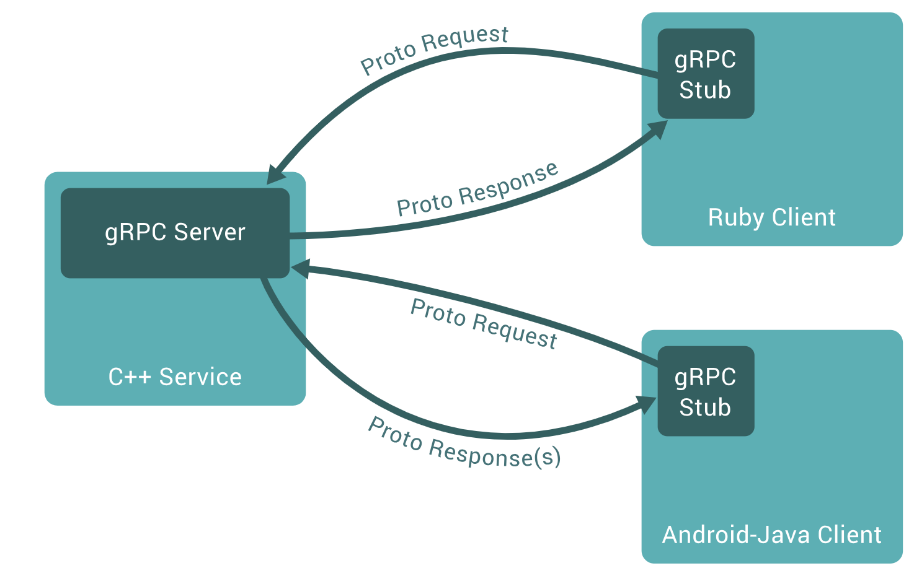

# Введение в gRPC: Основы, применение, плюсы и минусы. Часть I.

## Что такое gRPC?

[gRPC](https://grpc.io/) (gRPC Remote Procedure Call) — это современная высокопроизводительная фреймворк для удаленных вызовов процедур, разработанная Google. gRPC позволяет клиентам и серверам общаться напрямую, используя протокол HTTP/2 и Protocol Buffers (protobuf) в качестве языка описания интерфейсов (IDL). Эта технология предоставляет возможность эффективного взаимодействия между различными компонентами распределенных систем, независимо от языка программирования.

## Основы технологии

gRPC основывается на архитектуре клиент-сервер и поддерживает множество языков программирования, включая C++, Java, Python, Go, Ruby и многие другие. В основе gRPC лежат следующие ключевые компоненты:

1. **Protocol Buffers (protobuf):** Это язык описания данных и инструмент сериализации, который используется для определения сервисов и их методов, а также для обмена данными между клиентом и сервером. Protobuf позволяет описывать структуру данных в специальном `.proto` файле, который затем компилируется в исходный код для выбранного языка программирования.

2. **HTTP/2:** Протокол транспортного уровня, который обеспечивает мультиплексирование запросов, сжатие заголовков, и другие улучшения производительности по сравнению с HTTP/1.x. HTTP/2 позволяет отправлять несколько запросов через одно соединение, что значительно уменьшает задержки и улучшает пропускную способность.

3. **Stub-генерация:** gRPC автоматически генерирует клиентские и серверные stub'ы на основе protobuf-файлов, что упрощает процесс интеграции и уменьшает количество шаблонного кода. Клиенты используют сгенерированные stub'ы для вызова методов на сервере так, как если бы они вызывали локальные функции.

## Для чего применяется gRPC?

gRPC широко используется для построения распределенных систем и микросервисных архитектур. Вот несколько типичных сценариев его применения:

1. **Микросервисы:** В больших системах, где микросервисы взаимодействуют друг с другом, gRPC обеспечивает эффективное и надежное общение с низкой задержкой. Это особенно полезно в системах, где важно минимизировать время отклика и обеспечить высокую пропускную способность.

2. **Взаимодействие между разными языками:** Благодаря поддержке множества языков, gRPC позволяет разрабатывать системы, где компоненты написаны на разных языках программирования, легко взаимодействуя между собой. Это упрощает интеграцию различных технологий и позволяет выбирать наиболее подходящий язык для каждого компонента системы.

3. **Реализация API:** gRPC идеально подходит для создания высокопроизводительных API, где критичны низкие задержки и высокая пропускная способность. API, реализованные с помощью gRPC, могут использоваться как внутри организации, так и предоставляться внешним пользователям.

4. **Мобильные и IoT приложения:** gRPC отлично подходит для мобильных и IoT приложений благодаря своей эффективности и низкому потреблению ресурсов. HTTP/2 обеспечивает минимальное использование сетевых ресурсов, что особенно важно для устройств с ограниченными возможностями.

## Преимущества gRPC

1. **Высокая производительность:** Благодаря использованию HTTP/2 и protobuf, gRPC обеспечивает низкие задержки и высокую пропускную способность. Это делает его идеальным выбором для высоконагруженных систем.

2. **Ясно определенные интерфейсы:** Использование protobuf для описания сервисов и сообщений обеспечивает четкую контрактность и минимизацию ошибок на этапе компиляции. Это упрощает процесс разработки и интеграции различных компонентов системы.

3. **Поддержка различных языков:** gRPC поддерживает множество языков программирования, что позволяет интегрировать компоненты, написанные на разных языках, в единую систему. Это упрощает использование существующего кода и технологий.

4. **Би-ди стриминг:** gRPC поддерживает не только однонаправленные и двунаправленные потоки, но и полный дуплекс, что позволяет реализовать сложные сценарии взаимодействия. Это особенно полезно для приложений, требующих постоянного обмена данными в реальном времени, таких как чаты или системы мониторинга.

5. **Автоматическая генерация кода:** gRPC генерирует клиентские и серверные stub'ы, что упрощает разработку и снижает количество шаблонного кода. Это сокращает время разработки и уменьшает количество ошибок, связанных с ручным написанием кода.

## Недостатки gRPC

1. **Крутая кривая обучения:** Для новичков gRPC может показаться сложным из-за необходимости освоения protobuf и специфических особенностей HTTP/2. Однако, с практикой и доступными ресурсами, обучение становится легче.

2. **Ограниченная поддержка браузеров:** gRPC не поддерживается большинством браузеров напрямую, что требует использования дополнительных прокси-серверов или gRPC-Web. Это добавляет дополнительную сложность при создании веб-приложений, использующих gRPC.

3. **Зависимость от protobuf:** Использование Protocol Buffers как основного формата сериализации может быть ограничением для тех, кто предпочитает другие форматы, такие как JSON или XML. Хотя protobuf предлагает высокую производительность и компактность, он требует дополнительных шагов для сериализации и десериализации данных.

4. **Инфраструктурные требования:** Для эффективного использования gRPC необходимо обеспечить поддержку HTTP/2 на уровне сетевой инфраструктуры, что может потребовать дополнительных настроек и ресурсов. Это может стать препятствием для некоторых организаций, особенно если их существующая инфраструктура не поддерживает HTTP/2.

## Заключение

gRPC — это мощный инструмент для построения высокопроизводительных распределенных систем и микросервисов. Он обеспечивает эффективное общение между сервисами, поддерживает множество языков программирования и предлагает ясные и контрактно-ориентированные интерфейсы. Однако, как и любая технология, gRPC имеет свои недостатки и требует определенных усилий для освоения и интеграции.

Если вы строите сложную распределенную систему или ищете способ улучшить взаимодействие между микросервисами, gRPC может стать отличным выбором, обеспечивая высокую производительность и надежность. Важно тщательно взвесить плюсы и минусы этой технологии и оценить ее применимость к вашему проекту, чтобы получить максимальную пользу от использования gRPC.