# Освоение gRPC на Python: Продвинутые техники. Часть III.


После рассмотрения прошлых тем gRPC на Python:
- [Введение в gRPC: Основы, применение, плюсы и минусы. Часть I.](https://habr.com/ru/articles/819821/)
- [Основы работы с gRPC на Python: создание сервиса с использованием FastAPI. Часть II.](https://habr.com/ru/articles/821065/)

Перейдем к третьей (завершающей) части, посвященной освоению gRPC, в которой разберем следующие темы:
1. Interceptor;
2. Трассировка с использованием Jaeger и OpenTelemetry;
3. Reflection;
4. Потоковая передача данных;
5. Health Checking и цепочка вызовов (Deadlines).

Перед тем, как приступить к рассмотрению тем по освоению gRPC, ознакомимся с архитектурой микросервиса,
реализованного в нашем демонстрационном проекте.

## Архитектура демонстрационного проекта

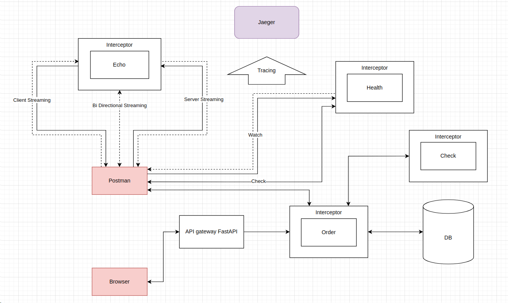

1. Postman - клиент-приложение для удобной демонстрации работы streaming запросов и ответов, а также для показа 
выполнения функционала reflection на стороне сервера.
2. Browser - клиент-приложение, используем любой браузер.
3. API gateway FastAPI - сервер, предназначенный для запуска gPRC сервисов и также для удобной демонстрации работы.
4. Interceptor - перехватчики в микросервисах gRPC, реализующие логику валидации запроса (аутентификацию).
5. Order - микросервис gRPC, реализующий CRUD операции заказов.
6. Check - микросервис gRPC, реализующий проверку статуса заказа. Служит для показа выполнения цепочки вызовов 
в микросервисной архитектуре.
7. Echo - микросервис gRPC, являющийся эхо-сервером. Служит для показа работы потоковой передачи данных.
8. Health - микросервис gRPC, реализующий проверку работоспособности сервиса.
9. Jaeger - платформа для трассировки, используемая для мониторинга микросервисной архитектуры.
10. Tracing(OpenTelemetry) - набор стандартов и инструментов для сбора данных о производительности и работы 
микросервисов.
11. DB - база данных (SQLite), используемая для хранения информации о заказах.


## Interceptor

[Interceptor](https://grpc.io/docs/guides/interceptors/) — это компонент, 
который позволяет перехватывать и изменять запросы и ответы на стороне клиента или сервера до их обработки или отправки. 
Interceptor позволяет добавлять дополнительную функциональность, такую как логирование, аутентификацию, авторизацию, 
кэширование и другие функции, не изменяя основной код приложения. В нашем случае, мы будем использовать данную технологию,
в качестве аутентификации.

Для демонстрации аутентификации с помощью Interceptor, была добавлена конечная точка **get_token** FastApi для получения 
**jwt-токена** с временем жизни 1 день, с помощью которого будем получать доступ к сервисам gRPC.

```python
@router.get("/get_token")
async def get_token() -> JSONResponse:
    payload = {
        "username": "0xN1ck",
        "exp": datetime.utcnow() + timedelta(days=1)
    }
    token = jwt.encode(payload, settings.SECRET_KEY, algorithm='HS256')
    return JSONResponse({'rpc-auth': f'{token}'}, status_code=status.HTTP_200_OK)
```

Итак, как же нам реализовать саму логику Interceptor? Для этого мы выполним следующие шаги:
1. Первым этапом создадим файл interceptor.py, в котором реализуем два класса **AuthInterceptor** - для сервера 
и **KeyAuthClientInterceptor** - для клиента.

```python
from functools import partial

import grpc
import jwt
from grpc.aio import ClientCallDetails


class AuthInterceptor(grpc.aio.ServerInterceptor):
    def __init__(self, key):
        # При инициализации создаем атрибут _valid_metadata,
        # который будет хранить секретный ключ для валидации токена пользователя
        self._valid_metadata = key

    @staticmethod
    async def deny(_, context, details):
        # Функция, предназначенная для отправки сообщений пользователю при отработках ошибок в функции intercept_service
        await context.abort(grpc.StatusCode.UNAUTHENTICATED, details)

    async def intercept_service(self, continuation, handler_call_details):
        # Получаем кортеж, содержащий метаданные
        metadatums = handler_call_details.invocation_metadata
        try:
            # Получаем токен из метаданных
            resault = next(filter(lambda x: x.key == 'rpc-auth', metadatums))
            if jwt.decode(resault.value, self._valid_metadata, algorithms=['HS256']):
                return await continuation(handler_call_details)
        except StopIteration:
            return grpc.unary_unary_rpc_method_handler(partial(self.deny, details="Токен не найден"))
        except jwt.ExpiredSignatureError:
            return grpc.unary_unary_rpc_method_handler(partial(self.deny, details="Время жизни токена истекло"))
        except jwt.InvalidTokenError:
            return grpc.unary_unary_rpc_method_handler(partial(self.deny, details="Токен не валиден"))


class KeyAuthClientInterceptor(grpc.aio.UnaryUnaryClientInterceptor):
    def __init__(self, user_token):
        # Получаем токен пользователя
        self.user_token: str = user_token

    async def intercept_unary_unary(self, continuation, client_call_details, request):
        # Добавляем токен в метаданные с ключом rpc-auth и отправляем запрос на сервер
        metadata = []
        if client_call_details.metadata is not None:
            metadata = list(client_call_details.metadata)
        metadata.append(("rpc-auth", self.user_token))
        new_details = ClientCallDetails(
            client_call_details.method,
            client_call_details.timeout,
            metadata,
            client_call_details.credentials,
            client_call_details.wait_for_ready,
        )
        response = await continuation(new_details, request)
        return response
```

В классе **KeyAuthClientInterceptor** добавляем токен в метаданные с ключом rpc-auth и отправляем запрос на сервер.  
В классе **AuthInterceptor** добавляем проверку на валидность токена. Если токен валиден, то пропускаем запрос далее,
в противном случае возвращаем ошибку.

Теперь нам нужно применить данные классы в наших клиентах и сервере gPRC.

Для сервиса **Order** реализуем клиента следующим образом в файле clients/order.py:

```python
import grpc
from fastapi import Request
from grpc_core.protos.order import order_pb2_grpc
from grpc_core.servers.interceptors import KeyAuthClientInterceptor
from settings import settings


async def grpc_order_client(request: Request):
    # Так как мы используем FastApi для демонстрации, прокинем токен в заголовок запроса
    auth = request.headers.get("rpc-auth")
    # При создании канала используем параметр interceptors для добавления нашего перехватчика, в который передаем токен
    channel = grpc.aio.insecure_channel(
        f'{settings.GRPC_HOST_LOCAL}:{settings.GRPC_PORT}',
        interceptors=[
            KeyAuthClientInterceptor(auth),
        ],
    )
    client = order_pb2_grpc.OrderServiceStub(channel)
    return client
```

Таким образом мы создаем клиента для сервиса **Order**, в который передаем наш перехватчик 
с полученным токеном для валидации. Для сервиса **Check** реализация клиента будет аналогичная.

И теперь регистрируем перехватчики на сервере похожим способом, как и на клиенте в файле servers/manager.py:

```python
self.server = aio.server(
    ThreadPoolExecutor(max_workers=10),
    interceptors=[
        AuthInterceptor(settings.SECRET_KEY),
    ]
)
```

Используем секретный ключ в классе **AuthInterceptor** для валидации токена.

P.S. В классе **KeyAuthClientInterceptor**, унаследованного от **grpc.aio.UnaryUnaryClientInterceptor**, мы создали 
interceptor для клиента, переопределив метод **intercept_unary_unary**, который служит для **унарных** *(UnaryUnary)* вызовов. 
Хотя в нашей архитектуре проекта видно, что мы будем рассматривать не только унарные вызовы, 
но и *UnaryStream*, *StreamUnary*, *StreamStream* в сервисе **Echo**, мы не определяли необходимые
перехватчики для клиента сервиса **Echo**, потому что будем использовать Postman для демонстрации, который 
реализует запросы к сервису собственными методами "из под капота". Создание данных перехватчиков можете рассмотреть
самостоятельно. Логика будет несильно отличаться.

Результат проделанной работы:

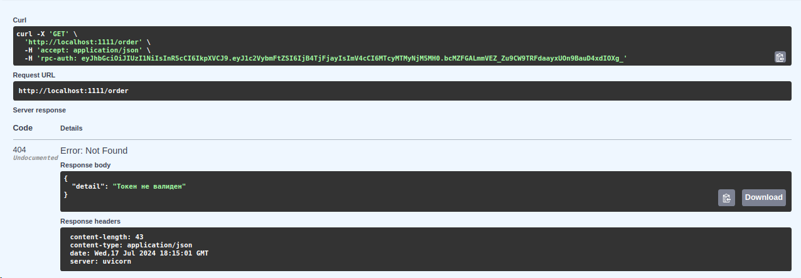  
Получаем в случае не валидного токена ошибку. Наблюдаем, что перехватчик исправно отработал.  


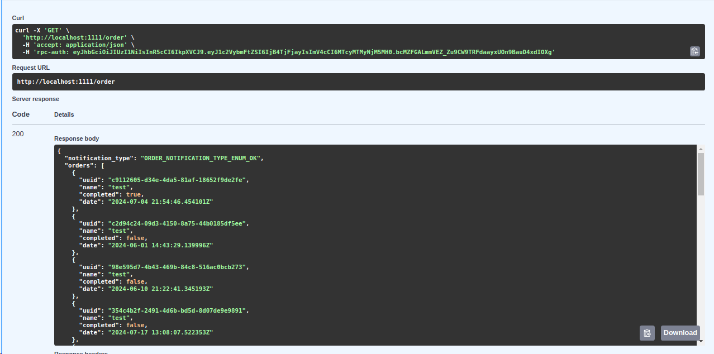  
В данном запросе видим, что с данным токеном запрос прошел успешно.


## Трассировка с использованием Jaeger и OpenTelemetry

При разработке микросервисов часто возникают проблемы с пониманием, что происходит внутри приложения и как запросы 
проходят через все эти сервисы. И для мониторинга таких процессов нам может помочь трассировка. Она может отслеживать, 
как запросы проходят через разные части системы, и видеть, сколько времени занимает каждая операция. 
Это важно, потому что в микросервисной архитектуре запрос может проходить через десятки сервисов, и любая задержка 
или ошибка в одном из них может повлиять на работу всего приложения.  
[Jaeger](https://www.jaegertracing.io/) и [OpenTelemetry](https://opentelemetry.io/) — это два инструмента, которые 
помогают с трассировкой. Jaeger помогает следить за запросами в распределённых системах. OpenTelemetry — это открытый 
стандарт, который объединяет практики для сбора трассировок, метрик и логов.  
Приступим к процессу применения данных технологий на практике.  

Первым делом, при установке необходимых библиотек в демонстрационном проекте, пришлось понизить версию gRPC 
из-за конфликта зависимостей protobuf. Плагин в OpenTelemetry 
`from opentelemetry.exporter.jaeger.proto.grpc import JaegerExporter` требовал protobuf версии 3.20.0, 
а последняя версия gRPC использовала protobuf пятой версии. В файле *pyproject.toml* настроены все зависимости.

Следующим шагом необходимо развернуть сам сервис Jaeger. Для этого используем Docker Compose со следующим 
конфигурационным файлом.

```yaml
version: '3.9'

services:
  jaeger:
    image: jaegertracing/all-in-one:${JAEGER_VERSION:-latest}
    ports:
      - "16686:16686"
      - "4318:4318"
      - "14250:14250"
    environment:
      - LOG_LEVEL=debug
    networks:
      - jaeger-example

networks:
  jaeger-example:
```

Теперь можно приступить к написанию трассировочного кода. Для этого мы при запуске сервера gRPC (servers/manager.py)
реализуем настройку трассировки.

```python
# Создаем экспортёр для отправки трассировочных данных в Jaeger.
# Указываем адрес коллектора и разрешаем небезопасное соединение (без шифрования).
jaeger_exporter = JaegerExporter(
    collector_endpoint=f'{settings.JAEGER_HOST}:{settings.JAEGER_PORT}',
    insecure=True
)

# Создаем процессор для пакетной обработки трассировочных данных (спанов).
# Он будет собирать спаны и отправлять их в Jaeger с использованием созданного экспортёра.
span_processor = BatchSpanProcessor(jaeger_exporter)

# Устанавливаем глобальный провайдер трассировки.
# Указываем, что ресурс трассировки будет иметь имя "Order".
# Это имя будет использоваться для идентификации службы в системе трассировки.
trace.set_tracer_provider(
    TracerProvider(resource=Resource.create({SERVICE_NAME: "Order"}))
)

# Добавляем созданный процессор спанов в провайдер трассировки.
# Это необходимо для того, чтобы спаны обрабатывались и отправлялись в Jaeger.
trace.get_tracer_provider().add_span_processor(span_processor)

# Создаем инструмент для автоматической трассировки gRPC сервера.
grpc_server_instrumentor = GrpcAioInstrumentorServer()

# Включаем автоматическую трассировку для gRPC сервера.
# Это позволит автоматически отслеживать все вызовы gRPC на сервере.
grpc_server_instrumentor.instrument()

# Создаем инструмент для автоматической трассировки gRPC клиента.
grpc_client_instrumentor = GrpcAioInstrumentorClient()

# Включаем автоматическую трассировку для gRPC клиента.
# Это позволит автоматически отслеживать все вызовы gRPC с клиента.
grpc_client_instrumentor.instrument()
```

**Спан** представляет собой единицу выполнения операции. Он отслеживает конкретные события, связанные с запросом, создавая 
картину того, что произошло во время выполнения этой операции. 

Далее рассмотрим использование трассировочного кода в одном из наших сервисов. Возьмем для примера *OrderService* 
и реализуем трассировку в методе *ListOrders*.

```python
async def ListOrders(self, request, context) -> order_pb2.ListOrdersResponse:
    # Получаем трассировщик для текущего модуля
    tracer = trace.get_tracer(__name__)
    # Создаем новый span для текущего метода ListOrders
    with tracer.start_as_current_span("ListOrders") as span:
        try:
            logger.info(f'Получен запрос на получение списка заказов')
            result = await OrderHandler.list_orders()
            response = self.message.dict_to_rpc(
                data=result.dict(),
                request_message=order_pb2.ListOrdersResponse(),
            )

            # Устанавливаем атрибут статус-кода RPC в span
            span.set_attribute("rpc.grpc.status_code", "OK")
            # Добавляем событие успешного ответа в span
            span.add_event("Successful response", {"response": str(response)})
            return response

        except Exception as e:
            # Устанавливаем статус span как ошибочный и добавляем сообщение об ошибке
            span.set_status(Status(StatusCode.ERROR, str(e)))
            # Добавляем событие ошибки в span с деталями об ошибке
            span.add_event("Error response", {"error": str(e)})
```

Проверим, как будет отрабатывать наша трассировка.

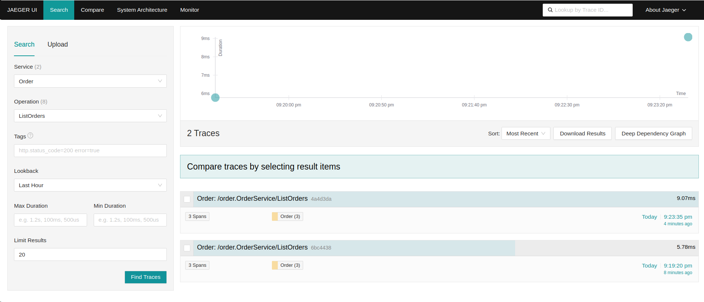

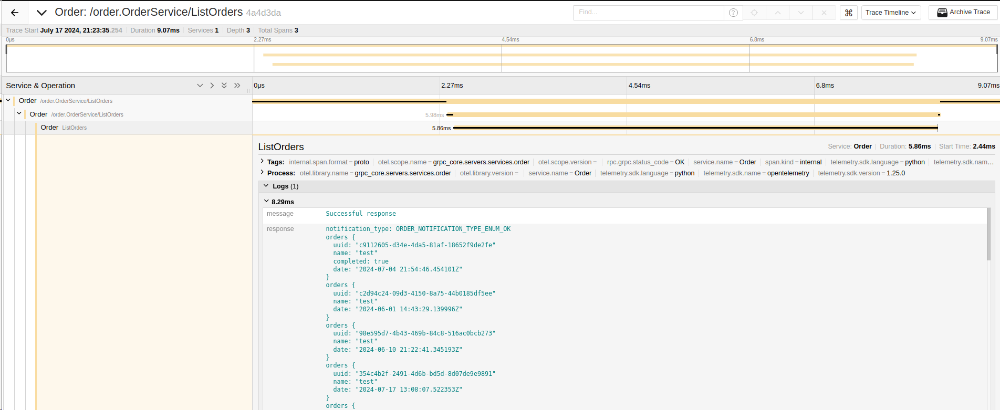  

Мы видим, что после отправки нескольких запросов, трассировка успешно произвела записи в Jaeger.


## Reflection

[Reflection](https://grpc.io/docs/guides/reflection/) - это механизм, который позволяет клиентам динамически 
исследовать возможности сервиса gRPC. Он предоставляет информацию о доступных методах и структурах данных сервиса, 
что упрощает разработку, отладку и тестирование, особенно в случаях, когда отсутствуют заранее подготовленные 
протобаф-файлы (protobuf). В нашем случае это упростит работу в приложение Postman. 

На практике настройка **Reflection** проста и настраивается в инициализации сервера gRPC (servers/manager.py).

```python
# Определение кортежа SERVICE_NAMES, содержащего полные имена сервисов, зарегистрированных на сервере.
SERVICE_NAMES = (
    # Получение полных имени сервисов (OrderService, ...) из дескрипторов (order_pb2, ...).
    order_pb2.DESCRIPTOR.services_by_name["OrderService"].full_name,
    echo_pb2.DESCRIPTOR.services_by_name["EchoService"].full_name,
    health_pb2.DESCRIPTOR.services_by_name["Health"].full_name,
    check_pb2.DESCRIPTOR.services_by_name["CheckStatusOrderService"].full_name,
    # Добавление стандартного имени сервиса reflection (reflection service).
    reflection.SERVICE_NAME,
)
# Включение reflection для перечисленных в SERVICE_NAMES сервисов.
reflection.enable_server_reflection(SERVICE_NAMES, self.server)
```

Так как на нашем сервере настроен *Interceptor*, то в *Postman* также потребуется добавить токен в метаданные.

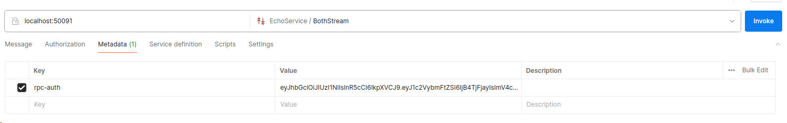

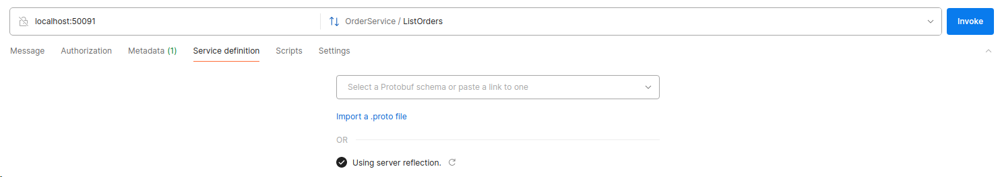

По скриншотам видно, что *Postman* увидел наши сервисы без применения protobuf-файлов.


## Потоковая передача данных

gRPC поддерживает четыре режима [взаимодействия](https://grpc.io/docs/languages/go/basics/) между сервером и клиентом:

1. **Unary gRPC** (Однонаправленное gRPC): клиент отправляет запрос и ожидает ответа от сервера.
2. **Server Streaming gRPC** (Потоковая передача от сервера): сервер отвечает на запрос клиента потоком сообщений, 
завершая передачу сообщением о состоянии.
3. **Client Streaming gRPC** (Потоковая передача от клиента): клиент отправляет поток сообщений серверу, который 
в ответ посылает одно подтверждающее сообщение.
4. **Bi Directional Streaming gRPC** (Двунаправленная потоковая передача): клиент и сервер обмениваются потоками 
сообщений одновременно, при этом каждый поток передается независимо в обоих направлениях.

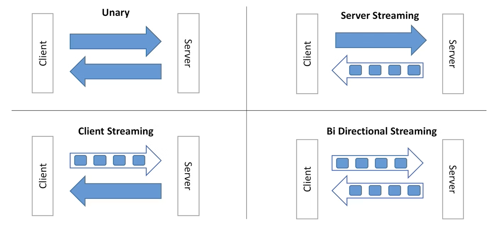

Так как до этого мы уже использовали обычные *Unary gRPC* (Однонаправленное gRPC) запросы, то пропустим данный пункт и 
рассмотрим остальные три режима взаимодействия в *Echo* сервисе.

Первым делом, когда начинаем писать сервис gRPC, наша работа начинается с protobuf-файла. Для эхо-сервера он будет 
выглядеть следующим образом:

```protobuf
syntax = "proto3";

package echo;

message EchoMessage {
	string username = 1;
	string message = 2;
}

message DelayedReply {
	repeated EchoMessage response = 1;
}

service EchoService {
	// Client Streaming
	rpc ClientStream (stream EchoMessage) returns (DelayedReply);

	// Server Streaming
	rpc ServerStream (EchoMessage) returns (stream EchoMessage);

	// Both Streaming
	rpc BothStream (stream EchoMessage) returns (stream EchoMessage);
}
```

После генерации python-файлов c помощью grpc-tools, как было рассмотрено в предыдущей нашей 
[статье]((https://habr.com/ru/articles/821065/)) приступим к написанию *Echo* сервиса (servers/services/echo.py). 

```python
import asyncio
from loguru import logger

from grpc_core.protos.echo import echo_pb2
from grpc_core.protos.echo import echo_pb2_grpc

from grpc_core.servers.utils import GrpcParseMessage


class EchoService(echo_pb2_grpc.EchoServiceServicer):
    def __init__(self):
        self.message = GrpcParseMessage()

    # Асинхронный метод для обработки клиентского стрима.
    async def ClientStream(self, request_iterator, context) -> echo_pb2.DelayedReply:
        # Создание ответа с отложенным ответом.
        response = echo_pb2.DelayedReply()
        # Асинхронный цикл для обработки каждого запроса из стрима.
        async for request in request_iterator:
            logger.info(f'Приняли запрос от стрим клиента: {self.message.rpc_to_dict(request)}')
            response.response.append(request)
        return response

    # Асинхронный метод для обработки серверного стрима.
    async def ServerStream(self, request, context):
        logger.info(f'Приняли запрос от клиента: {self.message.rpc_to_dict(request)}')
        # Цикл для отправки нескольких ответов клиенту.
        for _ in range(3):
            # Отправка текущего запроса обратно в качестве ответа.
            yield request
            logger.info(f'Ответил стрим сервер: {self.message.rpc_to_dict(request)}')
            await asyncio.sleep(1)

    # Асинхронный метод для обработки двунаправленного стрима.
    async def BothStream(self, request_iterator, context):
        # Асинхронный цикл для обработки каждого запроса из стрима.
        async for request in request_iterator:
            logger.info(f'Приняли запрос от стрима клиента: {self.message.rpc_to_dict(request)}')
            # Цикл для отправки нескольких ответов клиенту на каждый запрос.
            for i in range(3):
                # Отправка текущего запроса обратно в качестве ответа.
                yield request
                logger.info(f'Ответил стрим сервер: {self.message.rpc_to_dict(request)}')
                await asyncio.sleep(1)
```

Как видим, для эхо-сервера настройка streaming-методов *ClientStream*, *ServerStream* и *BothStream* была совсем
не сложной. Давайте посмотрим, как это все будет выглядеть в приложении Postman на примере *BothStream*.

*BothStream*
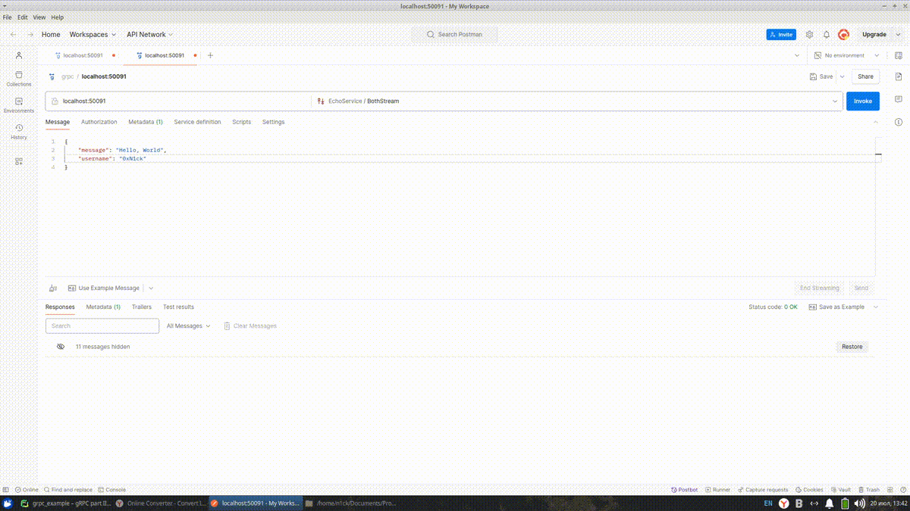


## Health Checking и цепочка вызовов (Deadlines).

### Health Checking

[Health Checking](https://grpc.io/docs/guides/health-checking/) - это механизм, используемый для мониторинга и контроля 
состояния сервисов, чтобы убедиться, что они работают должным образом и могут обрабатывать запросы.
Данная технология осуществляется с помощью функций *Check* и *Watch* и возвращает статусы: *UNKNOWN*, *SERVING*
и *NOT_SERVING*. Для проверки состояния используется функция *Check* с помощью отправки *Unary* запроса 
и для мониторинга - функция *Watch* с помощью *ServerStream* запроса.

Для рассмотрения *Health Checking* на практике реализуем сервис **Health** (servers/services/health.py). Данный подход
можно использовать и для других сервисов, которые выполняют свою логику, переопределив методы *Check* и *Watch*. Также 
можно ознакомится с примером, который указан на официальном сайте 
[gRPC Health Checking example](https://github.com/grpc/grpc/tree/master/examples/python/health_checking).

```python
import asyncio

from grpc_health.v1 import health_pb2
from grpc_health.v1 import health_pb2_grpc


class HealthService(health_pb2_grpc.HealthServicer):
    # Асинхронный метод для проверки состояния.
    async def Check(self, request, context):
        # Возвращаем объект HealthCheckResponse со статусом SERVING, указывая, что сервис работает нормально
        return health_pb2.HealthCheckResponse(
            status=health_pb2.HealthCheckResponse.SERVING
        )

    # Асинхронный метод для подписки на обновления (мониторинга) состояния.
    async def Watch(self, request, context):
        while True:
            current_status = health_pb2.HealthCheckResponse.SERVING
            response = health_pb2.HealthCheckResponse(status=current_status)
            yield response
            await asyncio.sleep(1)
```

### Цепочка вызовов (Deadlines).

Для рассмотрения данного вопроса был создан сервис *Check*, который принимает запрос от *Order*. 
Он выполняет логику проверки состояния заказа и возвращает статус его выполнения, и при 
получении ответа сервис *Order* обновляет статус заказа в БД. По итогу у нас получается следующая цепочка 
вызовов, в которой рассмотрим технологию [*Deadlines*](https://grpc.io/docs/guides/deadlines/).
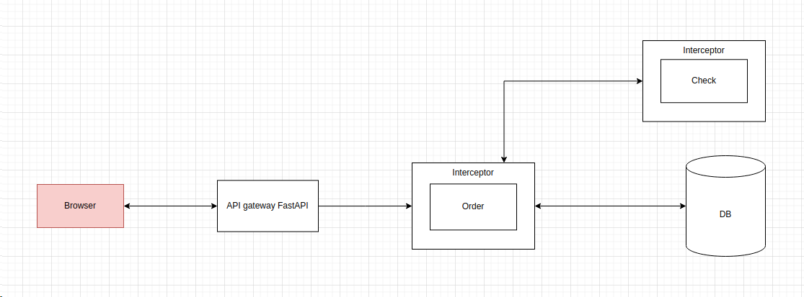

```python
# (api/oreder.py)
@router.post("/check")
async def check_order_status(
        uuid: str,
        client: t.Any = Depends(grpc_order_client),
        key: str = Security(api_key_header),
) -> JSONResponse:
    try:
        # устанавливаем тайм-аут в 2 секунды, определяя за сколько времени должна будет отработать вся цепочка вызовов
        order = await client.CheckStatusOrder(check_pb2.CheckStatusOrderRequest(uuid=uuid), timeout=2)
    except AioRpcError as e:
        raise HTTPException(status_code=404, detail=e.details())

    return JSONResponse(MessageToDict(order))
```

Далее на сервисе *Order* поставим ожидание в 1 секунду и выполним логгирование, чтобы убедиться, сколько времени 
еще осталось, перед отправкой запроса на сервис *Check*.

```python
await asyncio.sleep(1)
logger.info(f'Осталось времени в цепочке вызовов: {context.time_remaining()}') # 0.98

client = await grpc_check_client(auth=auth)
response = await client.CheckStatusOrder(
    check_pb2.CheckStatusOrderRequest(uuid=request.uuid),
    # передаем в тайм-аут, оставшееся время на выполнение
    timeout=context.time_remaining()
)

await OrderHandler.update_after_check_order(response)
```

Тут наблюдаем, что осталось всего 0.98 секунд. Если сервис *Check* не успеет за это время, то отработает исключение,
и можем получить следующий результат.

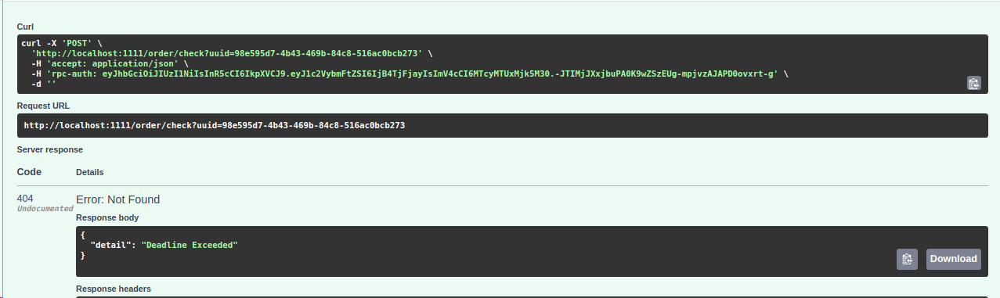

В случае, если мы поставим ожидание более 2 секунд на сервисе *Order*, то и запрос не пройдет далее и цепочка вызовов
будет завершена.

Из всего этого можно выделить следующие преимущества *Deadlines*:

- **Управление временем выполнения запросов.** 
Установка сроков позволяет ограничить время, в течение которого запрос может выполняться. 
Это предотвращает зависание клиента в ожидании ответа и позволяет более эффективно использовать ресурсы.
- **Повышение надежности системы.** Сроки помогают предотвратить ситуации, когда один медленный или зависший запрос 
блокирует выполнение других запросов. Это особенно важно в высоконагруженных системах.


## Заключение

Мы завершили серию статей, посвящённых изучению gRPC на Python, охватив широкий спектр тем и аспектов, которые 
пригодятся при проектировании gRPC-сервисов. В третьей заключительной части мы подробно рассмотрели:

1. **Interceptor**: Разобрались, как реализовать перехватчики для аутентификации запросов с использованием 
JWT-токенов. Технология позволяет добавлять дополнительную функциональность без изменения основного кода приложения.

2. **Трассировка с использованием Jaeger и OpenTelemetry**: Настроили и применили инструменты для трассировки, 
что позволяет отслеживать прохождение запросов через микросервисы и выявлять возможные задержки или ошибки.

3. **Reflection**: Реализовали механизм Reflection, который позволяет клиентам динамически исследовать возможности 
сервиса gRPC. Это упростило работу с Postman без необходимости заранее подготовленных protobuf-файлов.

4. **Потоковая передача данных**: Рассмотрели и реализовали различные типы взаимодействия 
(Client Streaming, Server Streaming, Bi-Directional Streaming) в gRPC на примере *Echo*-сервиса. 
Это позволило продемонстрировать обмен данными в реальном времени между клиентом и сервером.

5. **Health Checking и цепочка вызовов (Deadlines)**: Рассмотрели механизм Health Checking 
для мониторинга состояния сервисов, а также реализовали цепочку вызовов между микросервисами, 
применив использование *Deadlines* для контроля времени выполнения запросов.

В данной серии статей были охвачены ключевые аспекты и предоставлены практические примеры, которые помогут уверенно 
использоваться в ваших проектах. Теперь вы знаете, как создавать и интегрировать различные компоненты gRPC, 
что позволит строить эффективные и надёжные микросервисные архитектуры.

P.S. Для ознакомления с лабораторными проектом можно перейти по ссылке [grpc_example](https://github.com/0xN1ck/grpc_example)